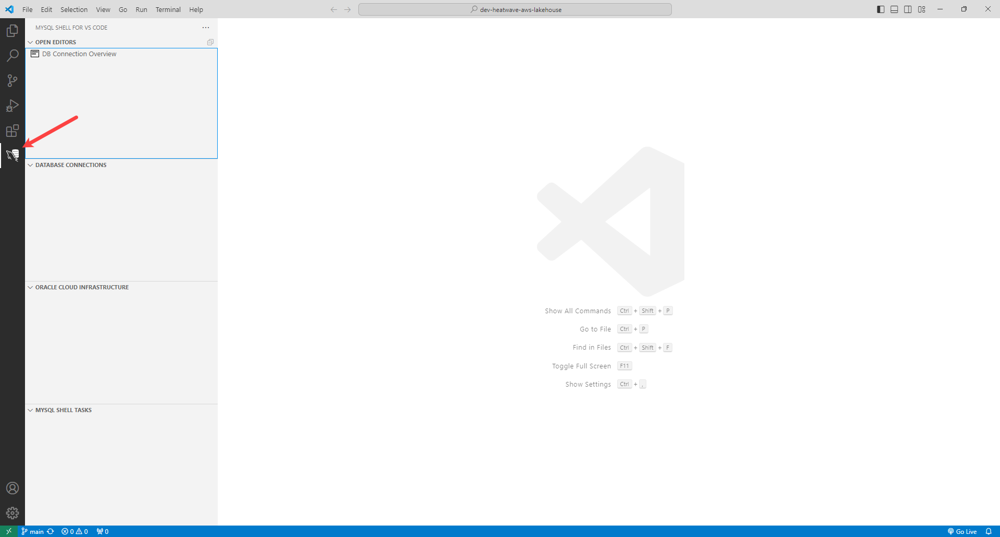
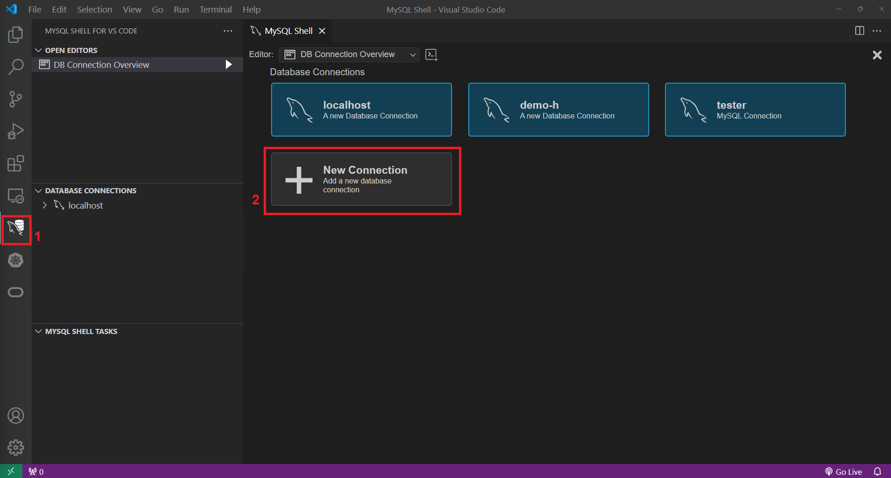
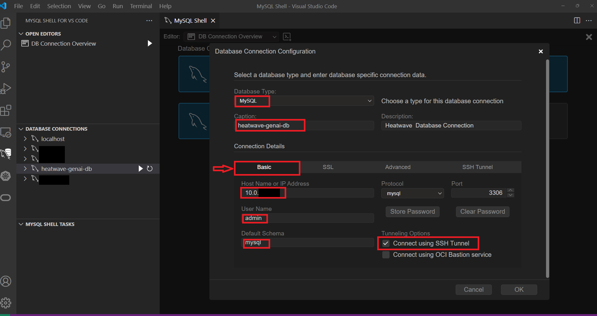
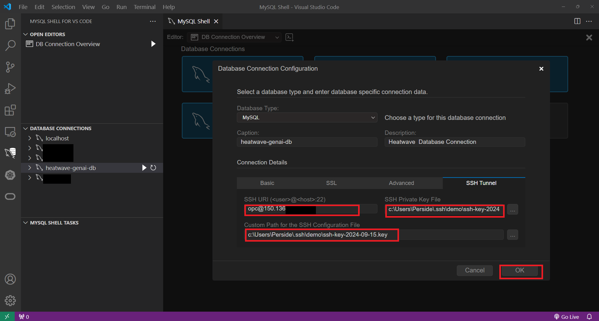
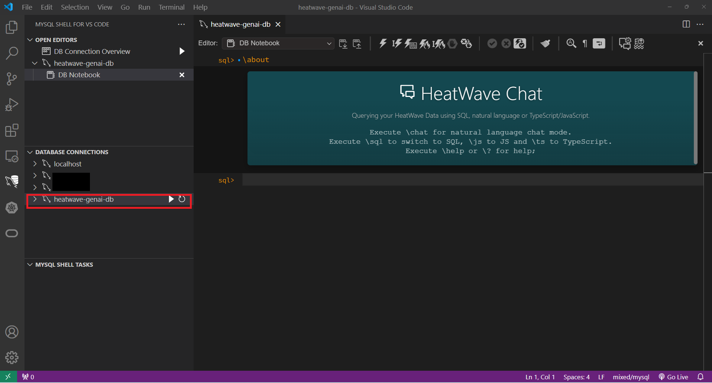
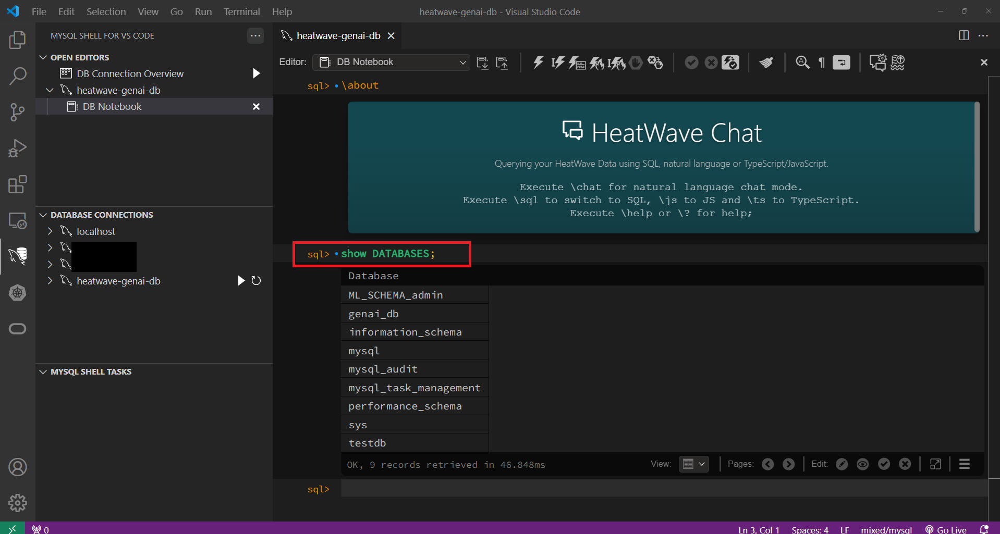

# Connect to the HeatWave Instance

## Introduction

In this lab you will setup MySQL Shell for Visual Studio Code, and connect to the HeatWave instance you created in Lab 1 from VS Code.

_Estimated Time:_ 30 minutes

### Objectives

In this lab, you will be guided through the following tasks:

- Setup MySQL Shell for Visual Studio Code.
- Connect to the HeatWave instance.

### Prerequisites

- You have completed Labs 1 and 2.
- Visual Studio Code is installed. If you do not have it installed, download and install from [here](https://code.visualstudio.com/download).

## Task 1: Setup MySQL Shell for Visual Studio Code

1. Launch **Visual Studio Code**.

2. Click **Extensions** and search for **MySQL Shell for VS Code**.

3. Click **Install**.
    

4. After MySQL Shell for VS Code is installed, you can see the following icon:
    

## Task 2: Connect to the HeatWave instance

1. In Visual Studio Code, Click the MySQL Shell for VS Code icon in the activity bar.
2. Click + on the DATABASE CONNECTIONS view toolbar.


3. Configure an HeatWave Database Connection - Basic section - as shown in the image below:

    - Select MySQL from the Database Type list.
    - In the Basic tab, enter the host name, protocol, user account information, and password
    - Be sure to enable **Connect SSH Tunnel**. This action opens the SSH Tunnel tab

4. Configure an HeatWave Database Connection - SSH Tunnel section - as shown in the image below:

    - Select mysql from the Database Type list. Provide a caption and a description to identify the connection.
    - In the Basic tab, enable Connect SSH Tunnel. This action opens the SSH Tunnel tab.
    - In the SSH Tunnel tab, do the following:
        - Specify a valid URI in the SSH URI field. Your URI consists of your SSH user name, the SSH host name, and the port number on which the host listens. For example: opc@ssh-compute-ip:22
        - Locate the SSH Private Key File
        - Set the Custom Path for the SSH Configuration File

5. Under **DATABASE CONNECTIONS**, click connection icon next to your HeatWave instance to connect to it. 

    

6. Check whether you are connected to the HeatWave instance by entering the following command and clicking **Execute the selection or full block on HeatWave and create a new block**.

    ```bash
    <copy>show databases;</copy>
    ```

    

You may now **proceed to the next lab**.

## Learn More

- [MySQL Shell for VS Code](https://dev.mysql.com/doc/mysql-shell-gui/en/)
- [HeatWave User Guide](https://dev.mysql.com/doc/heatwave/en/)
- [HeatWave on OCI User Guide](https://docs.oracle.com/en-us/iaas/mysql-database/index.html)
- [MySQL Documentation](https://dev.mysql.com/)


## Acknowledgements

- **Author** - Aijaz Fatima, Product Manager
- **Contributors** - Mandy Pang, Senior Principal Product Manager
- **Last Updated By/Date** -  Perside Foster, MySQL Principal Solution Engineer, September 2024