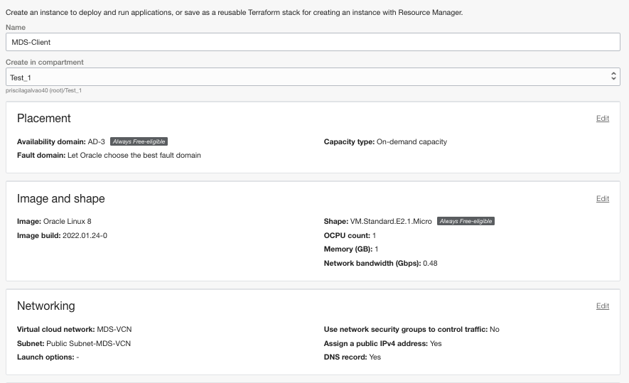
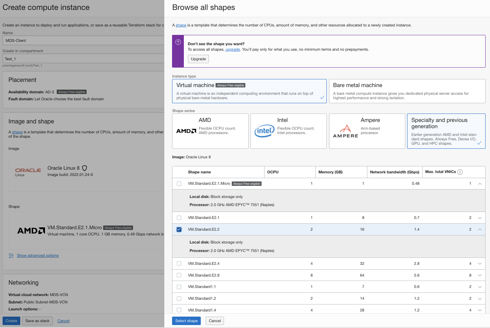
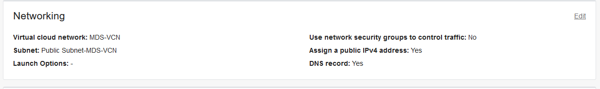
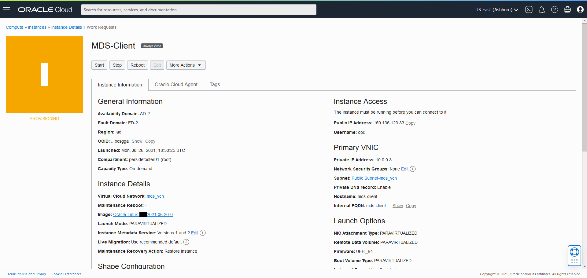

# Create Linux Compute Instance


## Introduction

Oracle Cloud Infrastructure Compute lets you provision and manage compute hosts, known as instances . You can create instances as needed to meet your compute and application requirements. After you create an instance, you can access it securely from your computer or cloud shell.


**Create Linux Compute Instance**

In this lab, you use Oracle Cloud Infrastructure to create an Oracle Linux instance. 

_Estimated Time:_ 10 minutes


### Objectives

In this lab, you will be guided through the following tasks:

- Create SSH Key on OCI Cloud 
- Create Compute Instance

### Prerequisites

- An Oracle Free Tier or Paid Cloud Account
- A web browser
- Should have completed the previous lab

## Task 1: Create Compute instance

You will need a compute Instance to connect to your brand new MySQL database. 

1. To launch a Linux Compute instance, go to 
    Navigation Menu
    Compute
    Instances
    

2. On Instances in **(root)** Compartment, click  **Create Instance**
    

3. On Create Compute Instance 

    Enter Name

    ```bash
    <copy>heatwave-genai-web-server</copy>
    ```

4. Make sure **(root)** compartment is selected

5. On Placement, keep the selected Availability Domain

6. On Image and Shape click the **Edit** link 
    - On Image: Keep the selected Image, Oracle Linux 8 

      

    - On Shape - Click the **change shape** button
    - Select Instance Shape: VM.Standard.E2.2

      

7. On Networking, make sure '**myvcn**' is selected

    'Assign a public IP address' should be set to Yes 

    

8. On Add SSH keys, paste the public key from the notepad. 
  
    

9. Click '**Create**' to finish creating your Compute Instance. 

10. The New Virtual Machine will be ready to use after a few minutes. The state will be shown as 'Provisioning' during the creation

    

11. The state 'Running' indicates that the Virtual Machine is ready to use. 

    

You may now **proceed to the next lab**.

## Acknowledgements

- **Author** - Perside Foster, MySQL Principal Solution Engineer
- **Contributors** - Mandy Pang, Senior Principal Product Manager
- **Last Updated By/Date** - Perside Foster, MySQL Principal Solution Engineer, September 2024
