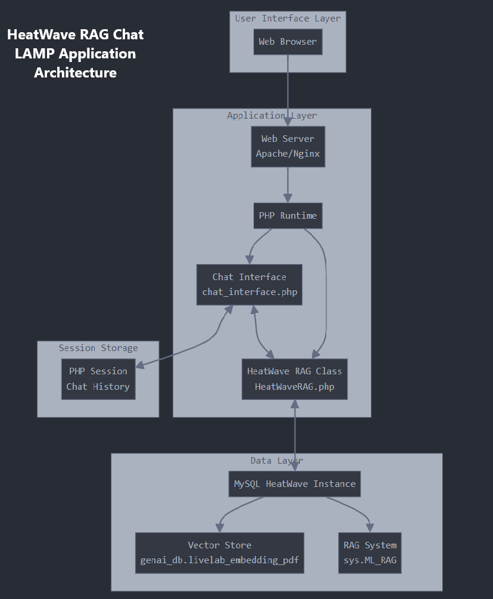
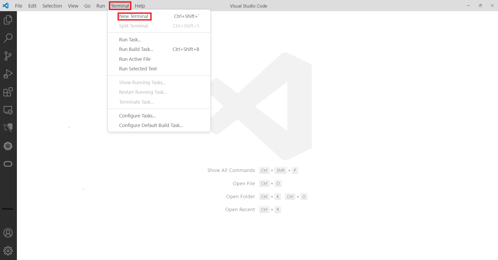
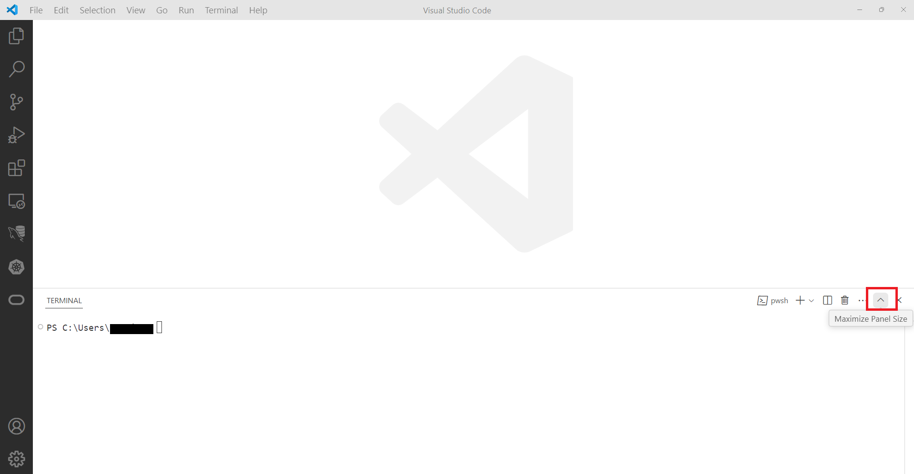
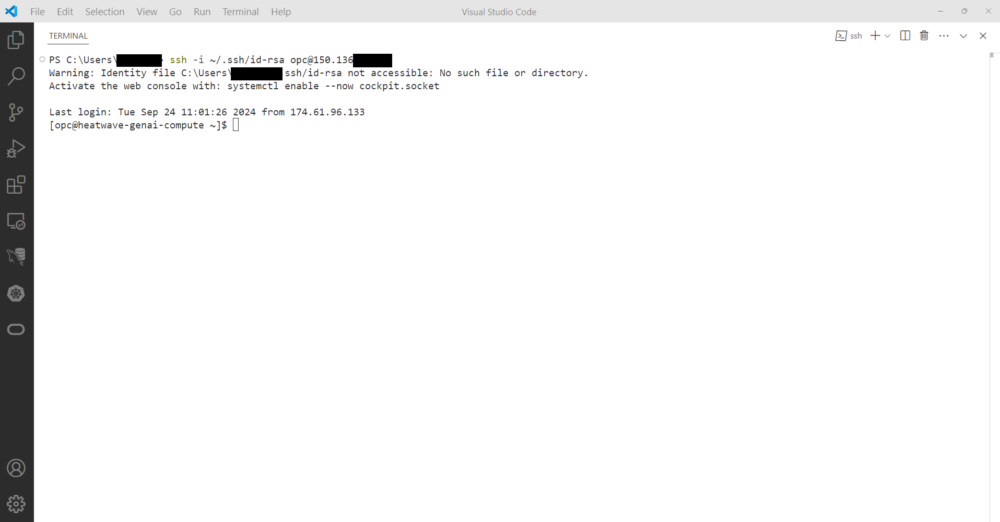
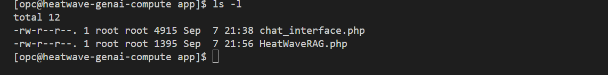

# Develop Build LAMP RAG-powered AI Chat Appxxx

## Introduction

MySQL HeatWave seamlessly integrates with existing Oracle services, such as Oracle Analytics Cloud, making it ideal for development tasks. Additionally, you can use MySQL HeatWave to create new applications using the LAMP stack (Linux, Apache, MySQL, PHP) or other software stacks.

In this lab you will build a LAMP stack and deploy a prebuilt  HeatWave RAG Chat Application. The application  is designed to make interacting with MySQL HeatWave's Retrieval-Augmented Generation (RAG) capabilities straightforward and user-friendly.

## Objectives

In this lab, you will be guided through the following tasks:

- Connect to Compute instance using VSCode and SSH
- Install Apache and PHP
- Create PHP / MYSQL Connect Application
- Create LAMP ApplicaConnect to Compute instance using VSCode and SSHtion
- Test LAMP Application

## Prerequisites

- Must complete Lab 5

## About the HeatWave RAG Chat Application

This application provides a user-friendly web interface for interacting with MySQL HeatWave's Retrieval-Augmented Generation (RAG) capabilities. It allows users to ask questions and receive AI-generated responses based on the information stored in the HeatWave database.

### Application Architecture Diagram

The following diagram provides a clear visual representation of how the different components of your MySQL HeatWave RAG Chat Application are structured and how they interact with each other. The arrows indicate the flow of data and interactions between the components. For example:

- The Web Browser interacts with the Web Server
- The PHP Runtime manages the Chat Interface and HeatWave RAG Class
- The HeatWave RAG Class interacts with the MySQL HeatWave Instance
- The Chat Interface interacts with the PHP Session for storing chat history



### Key Features:

1. Simple Web Interface: Easy-to-use chat interface for asking questions and viewing responses.
2. RAG Integration: Utilizes MySQL HeatWave's RAG functionality to generate informed responses.
3. Chat History: Maintains a session-based chat history for continuous conversations.
4. Citation Display: Shows relevant citations for the AI's responses, enhancing transparency and trustworthiness.
5. Clear History Option: Allows users to reset the chat history as needed.

### Technical Overview:

1. Backend: Linux, Apache, PHP, and MySQL HeatWave integration
2. Frontend: HTML and CSS for a responsive design
3. Data Storage: HeatWave Lakehouse and MySQL for vector embeddings and RAG processing

This solution bridges the gap between complex database operations and user-friendly interaction, making it easy for users to leverage the power of MySQL HeatWave's AI capabilities through a simple chat interface. This introduction provides a quick overview of what the application does, its main features, and a brief technical summary. It's designed to give users and developers a clear understanding of the solution at a glance

**Note:** This application code is intended for educational purposes only. It is designed to help developers learn and practice application development skills with MySQL HeatWave on OCI. The code is not designed to be used in a production environment

_Estimated Lab Time:_ 20 minutes


## Task 1: Connect to Compute instance using VSCode and SSH

1. In Visual Studio Code, click the **New Terminal**  in the menu bar to open a terminal screen.
    

2. Click **Maximize Icon** to set the terminal to full screen.

    

3. Connect to the Compute instance from the terminanl using SSH:
    - Indicate the location of the private key of your compute instance **heatwave-genai-compute**. 
    - Enter the username **opc** and the Public **IP Address** of your compute instance
    - (Your SSH login command should look like this: **ssh -i ~/.ssh/id_rsa opc@132.145.170...** 

    ```bash
    <copy>ssh -i ~/.ssh/id_rsa opc@<your_compute_instance_ip></copy>
    ```

    

## Task 2: Install App Server (APACHE)

1. Open OCI Cloud Consloe. If not already connected with SSH, on Command Line, connect to the Compute instance using SSH ... be sure replace the  "private key file"  and the "new compute instance ip"

     ```bash
    <copy>ssh -i private_key_file opc@new_compute_instance_ip</copy>
     ```

2. Install app server

    a. Install Apache

    ```bash
    <copy>sudo yum install httpd -y </copy>
    ```

    b. Enable Apache

    ```bash
    <copy>sudo systemctl enable httpd</copy>
    ```

    c. Start Apache

    ```bash
    <copy>sudo systemctl restart httpd</copy>
    ```

    d. Setup firewall

    ```bash
    <copy>sudo firewall-cmd --permanent --add-port=80/tcp</copy>
    ```

    e. Reload firewall

    ```bash
    <copy>sudo firewall-cmd --reload</copy>
    ```

3. From a browser test apache from your loacal machine using the Public IP Address of your Compute Instance

    **Example: http://129.213....**

## Task 3: Install PHP

1. Install php:

    a. Install php:7.4

    ```bash
    <copy> sudo dnf module install php:7.4 -y</copy>
    ```

    b. Install associated php libraries

    ```bash
    <copy>sudo yum install php-cli php-mysqlnd php-zip php-gd php-mbstring php-xml php-json -y</copy>
    ```

    c. View  php / mysql libraries

    ```bash
    <copy>php -m |grep mysql</copy>
    ```

    d. View php version

    ```bash
    <copy>php -v</copy>
    ```

    e. Restart Apache

    ```bash
    <copy>sudo systemctl restart httpd</copy>
    ```

2. Create test php file (info.php)

    ```bash
    <copy>sudo nano /var/www/html/info.php</copy>
    ```

3. Add the following code to the editor and save the file (ctr + o) (ctl + x)

    ```bash
    <copy><?php
    phpinfo();
    ?></copy>
    ```

4. From your local machine, browse the page info.php

   Example: http://129.213.167.../info.php

## Task 4: Create MySQL HeatWave / PHP connect Test app

1. Security update"   set SELinux to allow Apache to connect to MySQL

    ```bash
    <copy> sudo setsebool -P httpd_can_network_connect 1 </copy>
    ```

2. Create config.php

    ```bash
    <copy>cd /var/www/html</copy>
    ```

    ```bash
    <copy>sudo nano config.php</copy>
    ```

3. Add the following code to the editor. Update DB_SERVER with the MySQL DB IP abddress, update the username and password then save the file (ctr + o) (ctl + x)

     ```bash
        <copy><?php
    // Database credentials
    define('DB_SERVER', '10.0.1...');// MDS server IP address
    define('DB_USERNAME', 'admin');
    define('DB_PASSWORD', 'Welcome#12...');
    define('DB_NAME', 'mysql');
    //Attempt to connect to MySQL database
    $link = mysqli_connect(DB_SERVER, DB_USERNAME, DB_PASSWORD, DB_NAME);
    // Check connection
    if($link === false){
        die("ERROR: Could not connect. " . mysqli_connect_error());
    }
    // Print host information
    echo 'Successfull Connect.';
    echo 'Host info: ' . mysqli_get_host_info($link);
    ?>
    </copy>
    ```

    - Test Config.php on Web sever http://150.230..../config.php

4. Create dbtest.php

    ```bash
    <copy>cd /var/www/html</copy>
    ```

    ```bash
    <copy>sudo nano dbtest.php</copy>
    ```

5. Add the following code to the editor and save the file (ctr + o) (ctl + x)

    ```bash
    <copy>
    <?php
    require_once "config.php";
    $query = "SELECT user FROM mysql.user;";
    if ($stmt = $link->prepare($query)) {
    $stmt->execute();
    $stmt->bind_result($user);
    echo "<table>";
        echo "<tr>";
        echo "<th>User</th>";
    echo "</tr>";

    while ($stmt->fetch()) {
        echo "<tr>";
        echo "<td>" . $user ."</td>";
        echo "</tr>";
    }

    $stmt->close();
    }
    ?>
    </copy>
    ```

6. From your local  machine connect to dbhwtest.php

    Example: http://129.213.167..../dbtest.php  

## Task 5: Deploy HeatWave RAG Chat Application

1. Go to the development folder

    ```bash
    <copy>cd /var/www/html</copy>
    ```

2. Download application code

    ```bash
    <copy> sudo wget sudo wget https://objectstorage.us-ashburn-1.oraclecloud.com/p/XZ6EnSdgTwzEvNUtrWHUlqYS9pVnwC6HVhqq0c4XbtDREUE7kYnm7hQ-BrRjM6ju/n/mysqlpm/b/mysql_gen_ai/o/php-rag-chat-app/app.zip</copy>
    ```

3. unzip Application code

    ```bash
    <copy>sudo unzip app.zip</copy>
    ```

    ```bash
    <copy>cd app</copy>
    ```

    ```bash
    <copy>ls -l</copy>
    ```

    You should see the following two files:

    - chat_interface.php
    - HeatWaveRAG.php

    

4. In chat_interface.php, locate the following line

    - "$rag = new HeatWaveRAG('your\_mysql\_host', 'your\_username', 'your\_password', 'genai\_db');"
    - Replace 'your\_mysql\_host', 'your\_username', and 'your\_password' with your actual MySQL HeatWave connection details.
    - example:  $rag = new HeatWaveRAG('10.0.1...', 'admin', 'Welcom...', 'genai_db');

    ```bash
    <copy>sudo nano chat_interface.php</copy>
    ```

## Task 6: Test HeatWave RAG Chat Application

1. Run the application as follows
    - Access the chat_interface.php file through your web browser (e.g., http://computeIP/app/chat_interface.php).
    - You'll see a chat interface with a text input field at the bottom.
    - Type your question into the input field and click "Send" or press Enter.
    - The application will send your query to the HeatWave RAG system and display the response along with any relevant citations.
    - Your chat history will be maintained across page reloads using PHP sessions.
    - To clear the chat history, click the "Clear Chat History" button at the bottom of the page.

2. Sample quesions

    - What is Oracle?
    - What is HeatWave?
    - What is MySQL?
    - How does HeatWave integrate with MySQL?
    - What is OCI?
    - Can you explain the benefits of using OCI for database management?

You may now **proceed to the next lab**.

## Learn More

- [HeatWave User Guide](https://dev.mysql.com/doc/heatwave/en/)

- [HeatWave on OCI User Guide](https://docs.oracle.com/en-us/iaas/mysql-database/index.html)

- [MySQL Documentation](https://dev.mysql.com/)

You may now **proceed to the next lab**.

## Acknowledgements

- **Author** - Perside Foster, MySQL Principal Solution Engineer
- **Contributors** - Mandy Pang, Senior Principal Product Manager
- **Last Updated By/Date** - Perside Foster, MySQL Principal Solution Engineer, September 2024