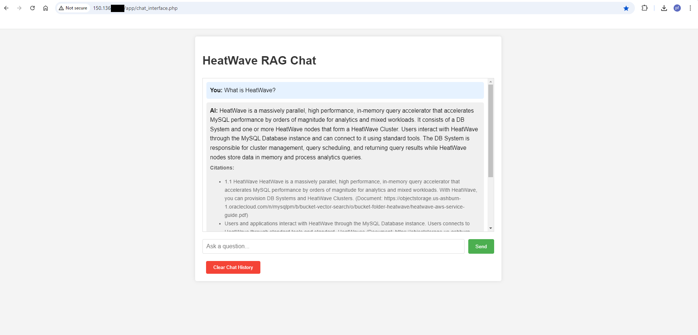

# Develop MySQL HeatWave App with LAMP

## Introduction

MySQL HeatWave seamlessly integrates with existing Oracle services, such as Oracle Analytics Cloud, making it ideal for development tasks. Additionally, you can use MySQL HeatWave to create new applications using the LAMP stack (Linux, Apache, MySQL, PHP) or other software stacks.

In this lab you will build a LAMP stack and deploy a prebuilt  HeatWave RAG Chat Application. The application  is designed to make interacting with MySQL HeatWave's Retrieval-Augmented Generation (RAG) capabilities straightforward and user-friendly.

Key features of the application:

Web-based chat interface for easy question-asking and response viewing
Integration with MySQL HeatWave's RAG functionality for informed AI responses
Session-based chat history for ongoing conversations
Citation display to show where information is sourced from
Option to clear chat history as needed

On the technical side, the application uses PHP for the backend, HTML and CSS for the frontend, and MySQL HeatWave for data storage and RAG processing. This solution bridges complex database operations with user-friendly interaction, allowing easy access to MySQL HeatWave's AI capabilities through a simple chat interface.


**Note:** This application code is intended for educational purposes only. It is designed to help developers learn and practice application development skills with MySQL HeatWave on OCI. The code is not designed to be used in a production environment

_Estimated Lab Time:_ 20 minutes

### Objectives

In this lab, you will be guided through the following tasks:

- Install Apache and PHP
- Create PHP / MYSQL Connect Application
- Create LAMP Application

### Prerequisites

- An Oracle Trial or Paid Cloud Account
- Some Experience with MySQL SQL and  PHP
- Completed Lab 4


## Task 1: Install App Server (APACHE)

1. Open OCI Cloud Consloe. If not already connected with SSH, on Command Line, connect to the Compute instance using SSH ... be sure replace the  "private key file"  and the "new compute instance ip"

     ```bash
    <copy>ssh -i private_key_file opc@new_compute_instance_ip</copy>
     ```

2. Install app server

    a. Install Apache

    ```bash
    <copy>sudo yum install httpd -y </copy>
    ```

    b. Enable Apache

    ```bash
    <copy>sudo systemctl enable httpd</copy>
    ```

    c. Start Apache

    ```bash
    <copy>sudo systemctl restart httpd</copy>
    ```

    d. Setup firewall

    ```bash
    <copy>sudo firewall-cmd --permanent --add-port=80/tcp</copy>
    ```

    e. Reload firewall

    ```bash
    <copy>sudo firewall-cmd --reload</copy>
    ```

3. From a browser test apache from your loacal machine using the Public IP Address of your Compute Instance

    **Example: http://129.213....**

## Task 2: Install PHP

1. Install php:

    a. Install php:7.4

    ```bash
    <copy> sudo dnf module install php:7.4 -y</copy>
    ```

    b. Install associated php libraries

    ```bash
    <copy>sudo yum install php-cli php-mysqlnd php-zip php-gd php-mbstring php-xml php-json -y</copy>
    ```

    c. View  php / mysql libraries

    ```bash
    <copy>php -m |grep mysql</copy>
    ```

    d. View php version

    ```bash
    <copy>php -v</copy>
    ```

    e. Restart Apache

    ```bash
    <copy>sudo systemctl restart httpd</copy>
    ```

2. Create test php file (info.php)

    ```bash
    <copy>sudo nano /var/www/html/info.php</copy>
    ```

3. Add the following code to the editor and save the file (ctr + o) (ctl + x)

    ```bash
    <copy><?php
    phpinfo();
    ?></copy>
    ```

4. From your local machine, browse the page info.php

   Example: http://129.213.167.../info.php

## Task 3: Create MySQL HeatWave / PHP connect Test app

1. Security update"   set SELinux to allow Apache to connect to MySQL

    ```bash
    <copy> sudo setsebool -P httpd_can_network_connect 1 </copy>
    ```

2. Create config.php

    ```bash
    <copy>cd /var/www/html</copy>
    ```

    ```bash
    <copy>sudo nano config.php</copy>
    ```

3. Add the following code to the editor. Update DB_SERVER with the MySQL DB IP abddress, update the username and password then save the file (ctr + o) (ctl + x)

     ```bash
        <copy><?php
    // Database credentials
    define('DB_SERVER', '10.0.1...');// MDS server IP address
    define('DB_USERNAME', 'admin');
    define('DB_PASSWORD', 'Welcome#12...');
    define('DB_NAME', 'mysql');
    //Attempt to connect to MySQL database
    $link = mysqli_connect(DB_SERVER, DB_USERNAME, DB_PASSWORD, DB_NAME);
    // Check connection
    if($link === false){
        die("ERROR: Could not connect. " . mysqli_connect_error());
    }
    // Print host information
    echo 'Successfull Connect.';
    echo 'Host info: ' . mysqli_get_host_info($link);
    ?>
    </copy>
    ```

    - Test Config.php on Web sever http://150.230..../config.php

4. Create dbtest.php

    ```bash
    <copy>cd /var/www/html</copy>
    ```

    ```bash
    <copy>sudo nano dbtest.php</copy>
    ```

5. Add the following code to the editor and save the file (ctr + o) (ctl + x)

    ```bash
    <copy>
    <?php
    require_once "config.php";
    $query = "SELECT user FROM mysql.user;";
    if ($stmt = $link->prepare($query)) {
    $stmt->execute();
    $stmt->bind_result($user);
    echo "<table>";
        echo "<tr>";
        echo "<th>User</th>";
    echo "</tr>";

    while ($stmt->fetch()) {
        echo "<tr>";
        echo "<td>" . $user ."</td>";
        echo "</tr>";
    }

    $stmt->close();
    }
    ?>
    </copy>
    ```

6. From your local  machine connect to dbhwtest.php

    Example: http://129.213.167..../dbtest.php  

## Task 4: Deploy HeatWave RAG Chat Application

1. Go to the development folder

    ```bash
    <copy>cd /var/www/html</copy>
    ```

2. Download application code

    ```bash
    <copy> sudo wget sudo wget https://objectstorage.us-ashburn-1.oraclecloud.com/p/W4gmtAY6PA-ABnH_LVYZhoK5X8UZrDxoOBfnMkLkEmJn6hhz8SYU1qoSanHNnz_-/n/mysqlpm/b/mysql_gen_ai/o/php-rag-chat-app/app.zip</copy>
    ```

3. unzip Application code

    ```bash
    <copy>sudo unzip app.zip</copy>
    ```

    ```bash
    <copy>cd app</copy>
    ```

    ```bash
    <copy>ls -l</copy>
    ```

    You should see the following two files:

    - chat_interface.php
    - HeatWaveRAG.php

    

4. In chat_interface.php, locate the following line

    - "$rag = new HeatWaveRAG('your_mysql_host', 'your_username', 'your_password', 'genai_db');"
    - Replace 'your_mysql_host', 'your_username', and 'your_password' with your actual MySQL HeatWave connection details.

    ```bash
    <copy>sudo nano chat_interface.php</copy>
    ```

5. Run the application as follows
    - Access the chat_interface.php file through your web browser (e.g., http://computeIP/app/chat_interface.php).
    - You'll see a chat interface with a text input field at the bottom.
    - Type your question into the input field and click "Send" or press Enter.
    - The application will send your query to the HeatWave RAG system and display the response along with any relevant citations.
    - Your chat history will be maintained across page reloads using PHP sessions.
    - To clear the chat history, click the "Clear Chat History" button at the bottom of the page.

6. Sample quesions

    - What is Oracle?
    - What is HeatWave?
    - What is MySQL ?
    - What is OCI ?

    

You may now **proceed to the next lab**.

## Learn More

- [HeatWave User Guide](https://dev.mysql.com/doc/heatwave/en/)

- [HeatWave on OCI User Guide](https://docs.oracle.com/en-us/iaas/mysql-database/index.html)

- [MySQL Documentation](https://dev.mysql.com/)

You may now **proceed to the next lab**.

## Acknowledgements

- **Author** - Aijaz Fatima, Product Manager
- **Contributors** - Mandy Pang, Senior Principal Product Manager
- **Last Updated By/Date** - Aijaz Fatima, Product Manager, August 2024